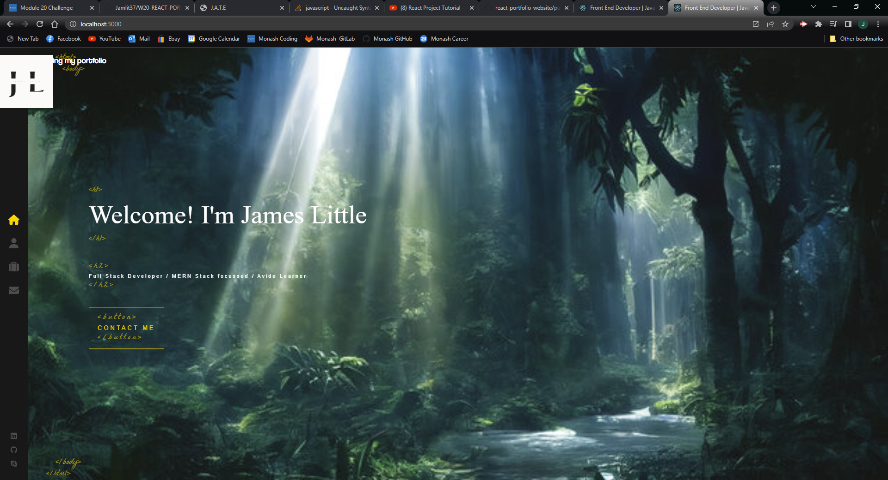

# W20-REACT-PORTFOLIO
## Description
Here is an updated portfoilio, a lot different from the one I made in my first few weeks of the Full stack development course. Hope you enjoy looking through and look forward to any feedback on how to improve.
## Installation
In order to be able to run the app from your own server, after being cloned you need to run, using node
```
npm i
```
Once node is installed, run the application you can use the following command
```
npm run start
```
## Screenshots of Application


## GitHub
If you want to vist my [GitHub](https://github.com/Jamlit37) or the [GitHub repository](https://github.com/Jamlit37/W20-REACT-PORTFOLIO) click the links
